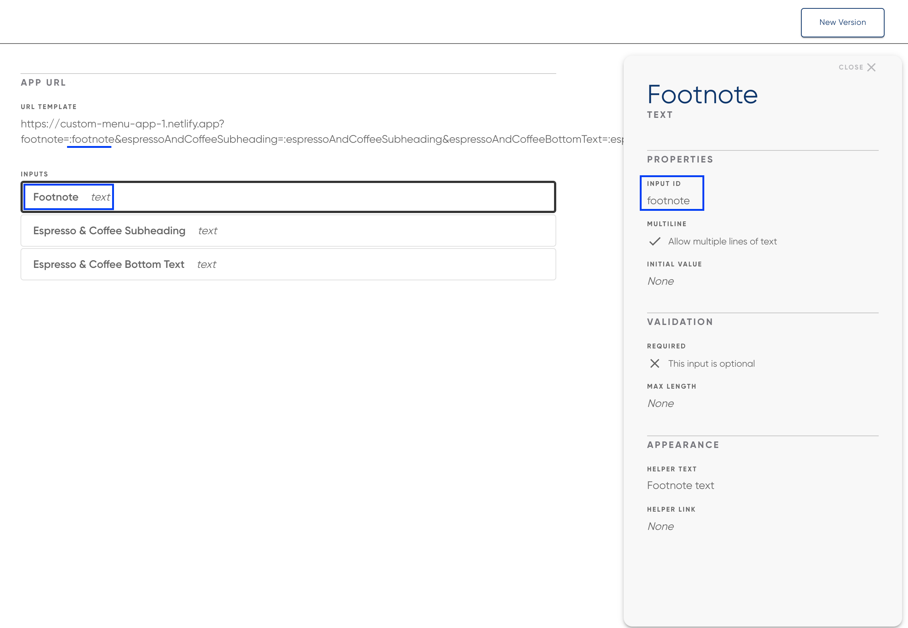
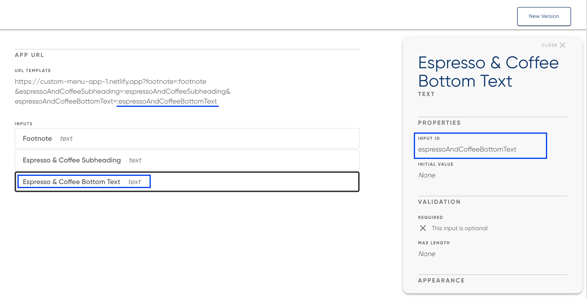
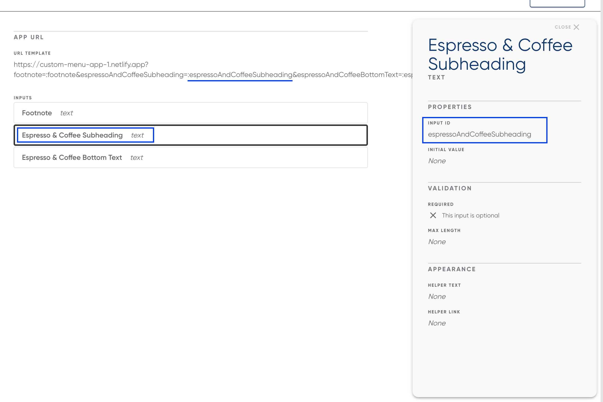

# NextJS Custom Menu App

## URLs

_Note: Instructions on how to fetch menu IDs for a given API key are available in the "Multi-location support" section below._

_Example menuId: 3404a063-2bbe-4473-bb1b-cac3c7e1d14e_

**Localhost**

- Main Menu Board: `http://localhost:3000?espressoAndCoffeeSubheading={espressoAndCoffeeSubheading}&espressoAndCoffeeBottomText={espressoAndCoffeeBottomText}&footnote={footnote}&menu={menuId}`

**Production**

- Main Menu Board: https://custom-menu-app-1.netlify.app?espressoAndCoffeeSubheading=<espressoAndCoffeeSubheading>&espressoAndCoffeeBottomText=<espressoAndCoffeeBottomText>&
  footnote=<footnote>&menuId={menuId}

## Prerequisities

- Node
- Yarn

## Development

1. Run `cp .env.sample .env.local` and populate env vars

2. Run the development server

```bash
yarn dev
```

## Adding App to Raydiant Platform

See [here](https://developers.raydiant.com/docs/get-started) for a comprehensive guide to building Raydiant apps.

## Builder Inputs

There are three builder inputs for this project. These can be configured after creating a new app in [Raydiant's Developer portal](https://developers.raydiant.com/)

- Footnote (text input) - Corresponds to a query param
  
- Bottom Text (text input) - Corresponds to a query param
  
- Subheading (text input) - Corresponds to a query param
  

[Code to retrieve query param](https://github.com/mirainc/custom-menu-samples/blob/8ae608baa41ffefbfc8cc63d0f0abc8011f97726/vanilla-js/js/scripts.js#L84-L88)

## Multi-location/menu support

A couple of additional steps are required for multi-location/menu support.

1. Using your API key, make a call to `/v1/menus` to retrieve the list of menus your API key has access to

**cURL example:**

```
curl --location --request GET 'https://menu-api.raydiant.com/v1/menus' \
--header 'x-api-key: <API_KEY>'
```

2. Take note of all the menu IDs required for your digital menu
3. Go to the developer portal and select your app
4. Creat a new "select" builder input
5. Populate the "options" section with the aforementioned `menuIds`
6. Confirm you can make an API request to fetch group data for a given menu/location

```
/v1/groups?tags=<tag>&menus=<menuId>depth=<depth>
```

## Deployment

CI/CD is setup to deploy our apps using the [Vercel Platform](https://vercel.com/new?utm_medium=default-template&filter=next.js&utm_source=create-next-app&utm_campaign=create-next-app-readme)

Check out our [Next.js deployment documentation](https://nextjs.org/docs/deployment) for more details.
